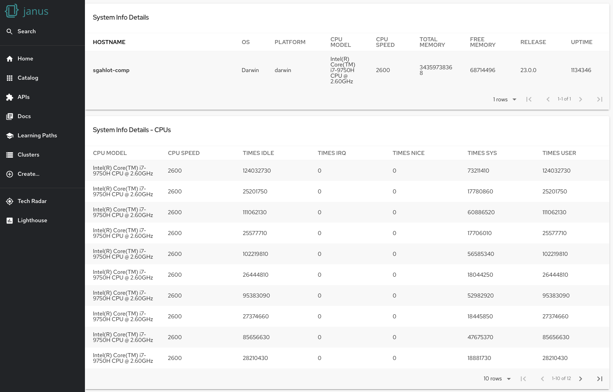
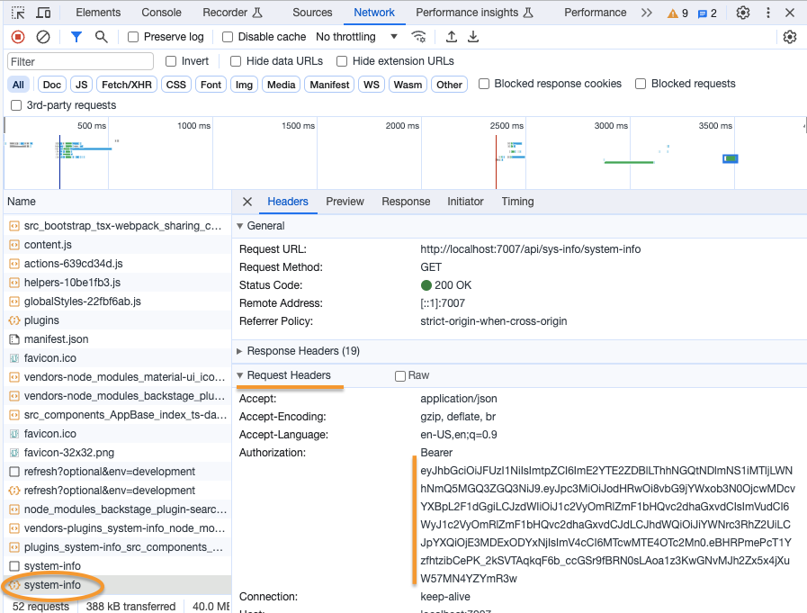
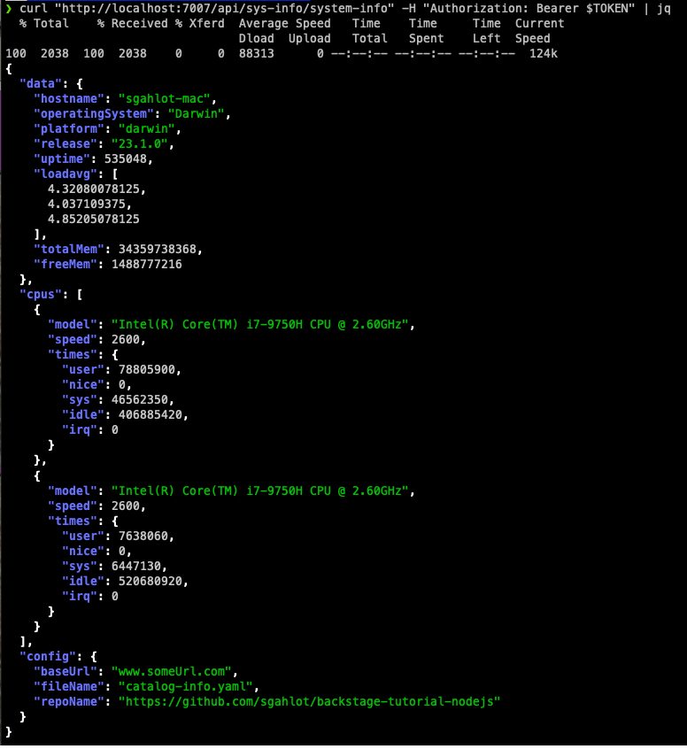
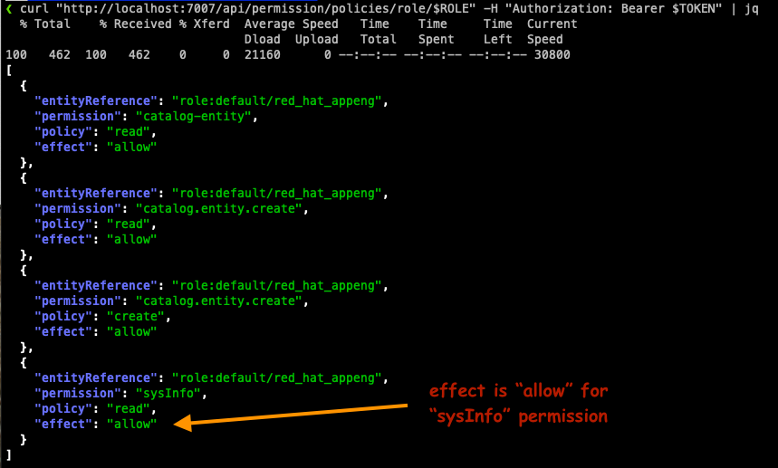
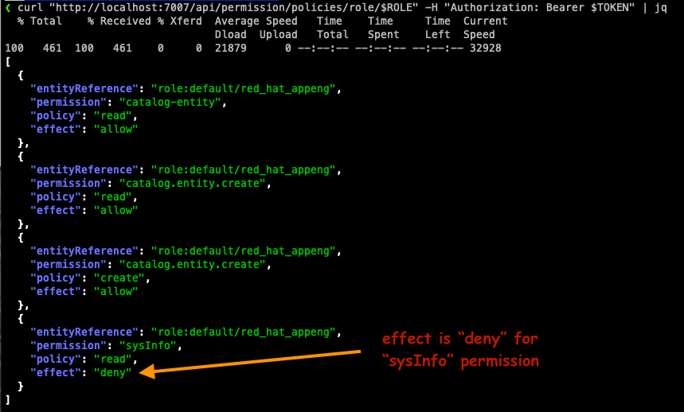
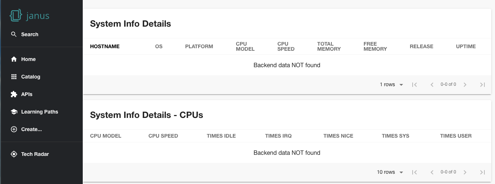
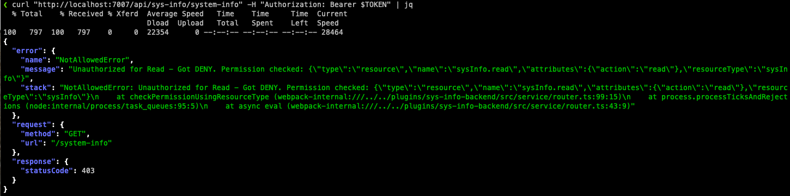
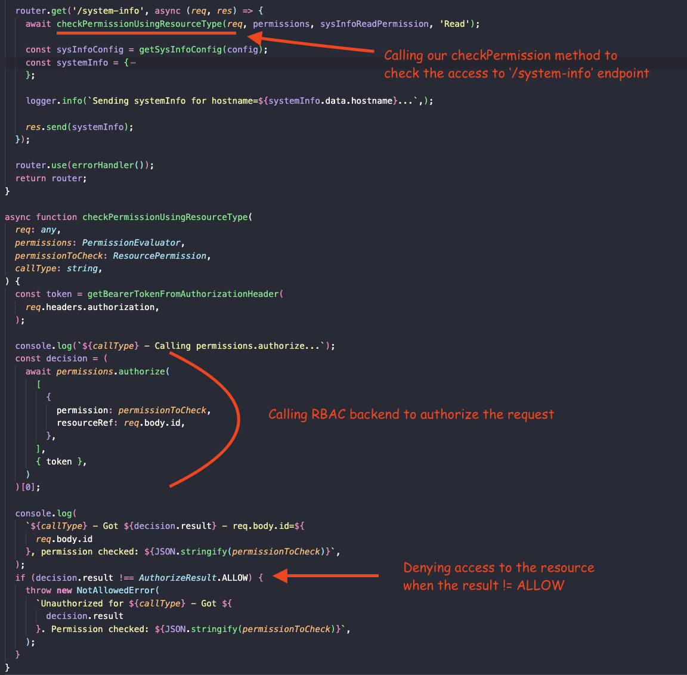

# [Janus Showcase](https://showcase.janus-idp.io) - RBAC with a policy file

- [RBAC policy file](#rbac-policy-file)
- [RBAC allow policy in action](#rbac-allow-policy-in-action)
  - [Run the app](#run-the-app)
  - [Login to GitHub](#login-to-github)
  - [Verify the RBAC policy for allow effect](#verify-the-rbac-policy-for-allow-effect)
- [RBAC deny policy in action](#rbac-deny-policy-in-action)
  - [Change the policy effecgt](#change-the-policy-effect)
  - [Verify the RBAC policy for deny effect](#verify-the-rbac-policy-for-allow-effect)
- [Code modifications needed for RBAC](#code-modification-for-rbac)
- [Conclusion](#conclusion)

## RBAC policy file

[Rbac policy file](./rbac-sample/rbac-policy.csv.template) contains the RBAC policy as well as the group for which the policy is applied. The policy is given below as well (with slight modification for the userId):

```
p, role:default/red_hat_appeng, catalog-entity, read, allow
p, role:default/red_hat_appeng, catalog.entity.create, read, allow
p, role:default/red_hat_appeng, catalog.entity.create, create, allow
p, role:default/red_hat_appeng, sysInfo, read, allow
g, user:default/sgahlot, role:default/red_hat_appeng
```

The policies are defined in the [Casbin rules format](https://casbin.org/docs/how-it-works). In the above example, we've defined four policies for `role:default/red_hat_appeng` and then added `user:default/sgahlot` to this role (essentially creating a group).

## RBAC allow policy in action

We will be showing the use of RBAC policy for our custom backend plugin and for that we have added the following policy:

```
p, role:default/red_hat_appeng, sysInfo, read, allow
```

The plugin we are making use of is `sys-info-backend`. This plugin has the following two endpoints:

- `/system-info`
- `/health`

For this demo, we have secured only the `/system-info` endpoint with the RBAC policy shown above that `allow`s `read` (GET) action on this plugin.

### Run the app

After checking out the code, run the following commands from the root directory of the checked out code:

```
cp rbac-sample/app-config.local.yaml.template app-config.local.yaml
cp rbac-sample/rbac-policy.csv.template rbac-policy.csv
```

Now, please modify the following files to use your own GitHub id:

- **rbac-policy.csv**:
  - `g, user:default/<CHANGE_TO_YOUR_GITHUB_ID>, role:default/red_hat_appeng`
- **app-config.local.yaml** - under `permission.rbac.admin.users`:
  - `- name: user:default/<CHANGE_TO_YOUR_GITHUB_ID>`

Set the following environment variables (for your GitHub OAuth app):

- `AUTH_GITHUB_CLIENT_ID`
- `AUTH_GITHUB_CLIENT_SECRET`

Set the following environment variable with a value of `true`:

- `PERMISSION_ENABLED`

Once the above changes are done, please run the following commands (_please make sure the yarn version is `1.22.19`_):

```
yarn install
yarn start-dev
```

### Login to GitHub

If you are not already logged into the GitHub, please do so by selecting `Sign in using GitHub` on the Sign-In method page. It should take the AUTH environment variables into account and log you to GitHub.

### Verify the RBAC policy for allow effect

#### From the UI

Now that you have logged in using your GitHub account, navibate to http://localhost:3000/system-info. This page should show System Info details along with the CPUs details similar to the image shown below:



#### From the cli

Let us try to get the system information using `curl` command. Both the frontend as well as the `curl` command should be hitting the same policy when trying to query the system information endpoint.

First we need to grab the JWT from UI before we can use the `curl` command as the JWT contains the user that is used for authorization of the resource. Follow the given steps to get the JWT:

- Open up Developer Tools in Chrome
- Select the **Network** tab in Developer Tools
- Navigate again to the http://localhost:3000/system-info page
- Once the page is refreshsed, click on **system-info** call and look for `Authorization` request header as shown below:
  
- Set an environment variable named `TOKEN` with the value of the JWT retrieved in previous step

Now, run the following commands in a terminal (`jq` is optional in the curl command):

```
export TOKEN='<JWT retrieved in previous steps>'
curl "http://localhost:7007/api/sys-info/system-info" -H "Authorization: Bearer $TOKEN" | jq
```

The output from `curl` command will be similar to the image shown below:



## RBAC deny policy in action

### Change the policy effect

Now that we have demonstrated the `read` (GET call) access is allowed for the endpoint in system-information, we will change the policy to deny access to the system-information endpoint.

Let us first set the following enviornment variables for our curl commands:

```
export USER='user:default/<CHANGE_TO_YOUR_GITHUB_ID>'   # Substitute with your github user id
export ROLE='default/red_hat_appeng'
export PERMISSION="sysInfo"
export PERMISSION_INITIAL_EFFECT="allow"
export PERMISSION_NEW_EFFECT="deny"
```

Let us first verify the existing policies for our role by running the following command:

```
curl "http://localhost:7007/api/permission/policies/role/$ROLE" -H "Authorization: Bearer $TOKEN" | jq
```

The above command should give an output similar to the image shown below:



To change the policy **effect** to `deny`, please run the following `curl` command:

```
curl -X PUT "http://localhost:7007/api/permission/policies/role/$ROLE" \
    -d "{\"entityReference\": \"role:${ROLE}\", \
         \"oldPolicy\": {\"permission\": \"${PERMISSION}\", \
                         \"policy\": \"read\", \
                         \"effect\":\"${PERMISSION_INITIAL_EFFECT}\"}, \
         \"newPolicy\": {\"permission\": \"${PERMISSION}\", \
                         \"policy\": \"read\", \
                         \"effect\":\"${PERMISSION_NEW_EFFECT}\"}}" \
    -H "Content-Type: application/json" -H "Authorization: Bearer $TOKEN"
```

Run the following command to verify that the permission has indeed changed for our role:

```
curl "http://localhost:7007/api/permission/policies/role/$ROLE" -H "Authorization: Bearer $TOKEN" | jq
```

The above command should give an output similar to the image shown below:



### Verify the RBAC policy for deny effect

#### From the UI

Now that you have logged in using your GitHub account, navibate to http://localhost:3000/system-info. This page should show `Backend data NOT found` message for both the System Info details as well as CPUs details similar to the image shown below:



#### From the cli

We should get a **deny** error from the backend when using the following `curl` command:

```
curl "http://localhost:7007/api/sys-info/system-info" -H "Authorization: Bearer $TOKEN" | jq
```

The output from `curl` command will be similar to the image shown below:



## Code modification for RBAC

Following changes were done to the codebase to showcase this RBAC feature:

- Added following in **packages/app/package.json** to the dependencies:
  - `"@internal/plugin-system-info": "^0.1.0",`
- Added following in **packages/backend/package.json** to the dependencies:
  - `"@internal/plugin-sys-info-backend": "^0.1.0",`
- Added following in **packages/app/src/components/AppBase/AppBase.tsx**:
  ```
  import { SystemInfoPage } from '@internal/plugin-system-info';    // with other imports
  <Route path="/system-info" element={<SystemInfoPage />} />        // with other routes
  ```
- Added following in **packages/backend/src/index.ts**:

  ```
  import sysInfo from './plugins/sys-info';    // with other imports

  // with other addPlugin statements
  await addPlugin({
    plugin: 'sys-info',
    apiRouter,
    createEnv,
    router: sysInfo,
    logger,
  });
  ```

- Added a new file named **packages/backend/src/plugins/sys-info.ts**
- Added custom backend plugin **plugins/sys-info-backend** with the RBAC
- Added custom backend plugin **plugins/system-info** (to use the above mentioned backend plugin)
- Added method in **plugins/sys-info-backend/src/service/router.ts** to check permission for a given resource:

  

## Conclusion

Using the policy file with RBAC backend plugin is easy as well as it is very easy to add/change a policy using the RBAC backend plugin's REST endpoints. There are some more endpoints and their usage given in the [RBAC sample file](./rbac-sample/rbac-sample.sh).
